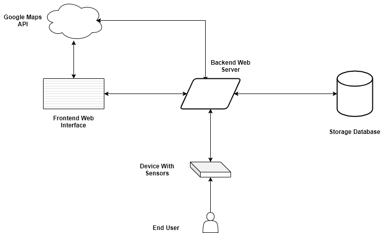
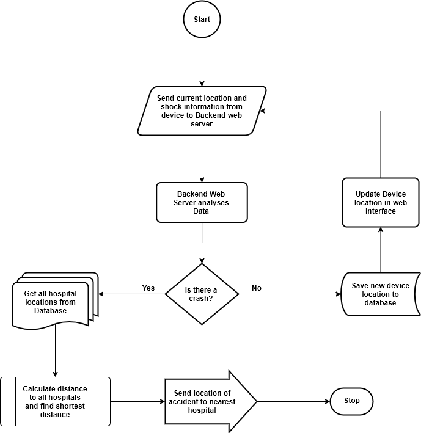

# React Automobile Crash Report

## Data Movement Diagram

The data movement diagram shows the movement of data across the complete system. That is, from the electronic device to the web platform and back.

From the diagram above, it is proposed that the sensor readings from the end user device will be sent to the backend web server using HTTP POST request ( this is done continuously, every 5 seconds ). This sensor reading data will contain the latitude and longitude information of the device as read from the GPS sensor onboard the device and information showing the sate of the shock sensing device.

On getting to the backend web server, this data is analyzed to see if a car crash has been detected or not. The received data is also stored in a database system in order to enable easy access to the last device location, in situations of an unexpected system reboot. The backend also connects to Google Maps API platform in order to calculate route between the current device location and the nearest hospital (all hospital locations are to be stored on the database).

The Frontend web interface connects to both the Google maps API platform and the backend web interface. From the Google Maps API platform if pulls down google map components for displaying on the user Admin web browser and from the backend web interface, it receives the current device location. Both data is merged to give a real time position of the device.

Flowchart Diagram

